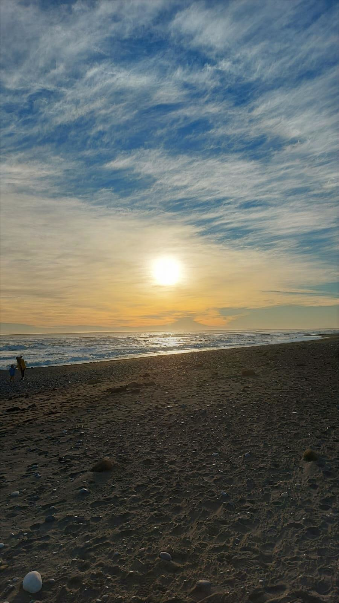
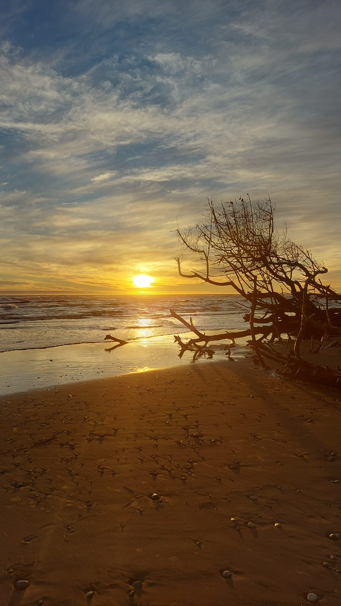
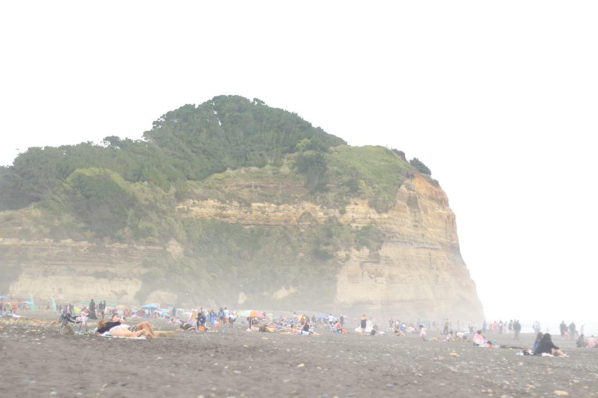
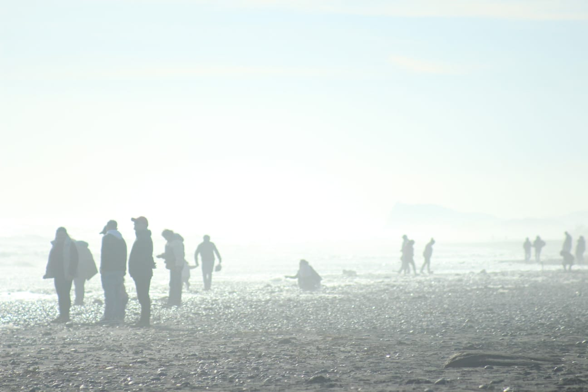

## Contexo

Puerto Saavedra goza de una hermosa playa de 2,2 km llamada **Playa
Maule**. Me gusta visitarla a menudo desde que vivo en esta ciudad. Es
un espacio que te permite apreciar la inmensidad del mar, empaparte de
su fuerza y calmar las angustias y tribulaciones en su entorno amable y
poderoso.

|  |  |
|:--:|:--:|
| {width="901"} |  |
| *Playa Maule a media tarde, a 200 metros de Cerro Maule el estacionamiento público.* | *Playa Maule al atardecer, a pocos metros de la barra Sur.* |

Y su belleza no radica solo en el cliché del atardecer en el mar, que se
cumple a cabalidad y de forma esplendorosa, si no que también la magia
inunda con misterio los días nublados.

|  |
|:--:|
|  |
| *Playa Maule un día nublado, a 500 metros del Cerro Maule abrazando en su extensión a cientos de turistas* |
|  |
| *Playa Maule en una tarde nublada. La neblina difumina a pocos metros las siluetas de los turistas.* |

En Puerto Saavedra la gente sabe que la playa se está yendo. Lo dicen
mis vecinos que han vivido aquí cuarenta años y recuerdan hasta dónde
llegaba la arena - "*...antes había un camino bajo el Cerro Maule de
unos 80 metros don Francisco. Ese camino llegaba hasta Boca Budi y se
conectaba hasta el Cerro La Mesa..." -*

Bueno..., que la playa se esté yendo, significa que la **línea costera
está retrocediendo,** y al menos a nivel local, ninguna institución
había calculado la tasa de retroceso. La gente lo sabía, la playa,
retrocedía, lo que no había (me salió verso sin esfuerzo), era un
indicador para la toma de decisiones.

Esa ausencia no es un detalle académico. Sin una cifra, la erosión
costera no entra en un instrumento de planificación, no justifica una
obra de protección y no compite por presupuesto con problemas que sí
están cuantificados. El diagnóstico territorial existe; el dato preciso,
no.

Ahora existe: **el sector de Playa Maule, frente al área poblada en
Avenida Miramar, retrocede 4,36 metros por año**. Acumulados sobre
cuatro décadas, son unos 174 metros de playa perdidos.

## Por qué no estaba medido

En la revisión de antecedentes, encontré diversa información sobre la
costa de Saavedra, y ninguna cuantifica el retroceso. Hay estudios
geomorfológicos regionales ([Peña-Cortés,
2014](https://scielo.conicyt.cl/pdf/rgeong/n58/art13.pdf)) que describen
la costa de La Araucanía sin entregar tasas de cambio. [Ledezma
(2020)](https://www.researchgate.net/publication/344242491_Interpretaciones_geologicas_de_remociones_en_masa_en_latitudes_medias_Caso_de_estudio_en_la_zona_de_Puerto_Saavedra_IX_Region)
realizó, en el marco del proyecto FONDECYT 11180500, el primer estudio
dedicado a interpretar geológicamente los procesos de remoción en masa
en la zona de Puerto Saavedra, incluyendo el primer mapa de
susceptibilidad para el sector, aunque acotado a procesos de ladera
puntuales sin proyección hacia el retroceso de la línea de costa.

Tampoco hay informes de organismos de emergencia que cuantifiquen el
proceso y la intervención institucional se limita a alertas operativas
por marejadas.

En el propio Plan de Acción Comunal de Cambio Climático de Saavedra,
reconocemos la erosión del borde costero como riesgo comunal, pero en su
diseño no se pudo cuantificar las cadenas de impacto por falta de
información local de base. Este levantamiento viene a resolver esta
brecha.

## Cómo se mide una playa desde el espacio

Cuando "vemos" un paisaje, en realidad vemos la luz del sol que ese
paisaje refleja. Nuestros ojos son sensores que "captan" la luz que les
llega de rebote al chocar, literalmente, con todo lo que alcanza nuestra
vista. Y esa luz le da texturas y colores a las cosas con las que
interactúa. Luego, nuestro cerebro interpreta esa información de
texturas y colores y nos permite discriminar en un paisaje lo que es un
árbol, lo que es una piedra, lo que es agua y lo que es suelo. Los
satélites hacen lo mismo, pero con unos SUPER OJOS, que les permiten
"ver" el calor que emitimos todos los seres vivos e incluso el nivel de
clorofila en un predio forestal. Y con esa supervista, los satélites, a
kilómetros sobre el suelo pueden discriminar MUCHAS más cosas que
nuestros ojos, en todo el espectro electromagnético (bandas
electromagnéticas). El siguiente video es una de los diversos resultados
y productos obtenidos del procesamiento satelital. **Ojito, que hay
varias transiciones que generan saltos intermitentes de luz blanca por
las nubes y correcciones de imagen. Estas podrían generar reacciones no
aptas para personas con epilepsia.**

::: {style="max-width: 800px; margin: 0 auto;"}

:::

El agua y la arena reflejan la luz de forma muy distinta en el
infrarrojo de onda corta: el agua absorbe casi toda esa energía y
aparece oscura, mientras la arena seca, la refleja. Combinando esa banda
con la del verde se obtiene un índice que separa ambas superficies con
nitidez, **y el límite entre las dos es la línea de costa.**

Lo que hace interesante el ejercicio no es medir una vez, sino medir
muchas. El archivo satelital abierto de la NASA y el Servicio Geológico
de Estados Unidos cubre la costa chilena desde 1986 de forma continua, y
el proyecto Copernicus lo complementa desde 2015 con mayor resolución.
**Son cuatro décadas de fotografías del mismo lugar, tomadas cada dos
semanas, disponibles sin costo.**

El levantamiento procesó **2.899 imágenes de cinco misiones
satelitales**, de las que obtuve **1.457 posiciones válidas de la línea
de costa**. Cada posición se mide con precisión subpíxel, mejor que el
tamaño nominal de la celda de 30 metros, mediante interpolación del
índice espectral.

Para cada una de esas 1457 líneas de costa válidas, extraje las nubes de
puntos para cada una y luego las representé en las siguientes
cartografías en 3 intervalos de tiempo que permiten visualizar las
variaciones a simple observación.

## El litoral no se comporta igual en todas partes

No basta con diseñar estas lindas cartografías para representar los
datos generados, si no que, para tomar las desiciones, es necesario un
análisis estadístico y de esta manera obtener los tan anhelados
indicadores que necesitamos para relevar el riesgo y comenzar a
apalancar recursos.

| Sector               | Transectos |      Tasa media |       R² | Cambio acumulado |
|:---------------------|-----------:|----------------:|---------:|-----------------:|
| Norte de Cerro Maule |         53 |     −0,02 m/año |     0,00 |            ≈ 0 m |
| **Playa Maule**      |         54 | **−4,36 m/año** | **0,81** |       **−174 m** |
| Sur de Boca Budi     |         20 |     −2,14 m/año |     0,53 |            −86 m |

: Tasas de cambio de la línea costera por sector, 1986–2026

Para obtener los valores de avance y retroceso de la línea costera, se
debe comparar el "cambio" entre el suelo y el agua respecto a una
referencia, que para este caso, resulta en una curva dibujada
manualmente, con resolución subpíxel a partir de una imagen satelital
despejada sin nubes y corregida. De los cientos de puntos que conforman
esta curva, se desprenden los "transectos", que serán rectas de 600
metros y exactamente perpendiculares a la costa, que están separadas por
50 metros cada una, tal como se muestra en la siguiente figura. Los
valores de avance y retroceso entonces serán, las distancias que
recorrerá la costa en cada transecto. De esta manera, los indicadores de
variación de la línea costera se obtienen cada 50 metros y con eso, ya
podemos interpretar y sectorizar. Es importante mencionar, que hay una
zona en la que no dibujé transectos, que corresponde a la barra norte de
la desembocadura. Esto se justifica, pues el fenómeno de migración de la
desembocadura causa "ruido" en el análisis de la retroceso de la línea
de costa en el sector poblado de playa Maule. En el siguiente post
incorporo ese fenómeno, para quienes queden "curiosos" y "chúcaros" de
esa información.

De los 127 transectos analizados, 74 presentan erosión significativa, 53
se mantienen sin tendencia neta y **ninguno registra avance de la línea
de costa**.

La diferencia entre el norte y el sur de Cerro Maule es tan marcada que
conviene mirarla en detalle. En Playa Maule el orden cronológico es la
firma de un desplazamiento sostenido, y explica el R² de 0,81. Al norte,
en cambio, el R² de 0,00 no significa que no pase nada, **significa que
lo que pasa no tiene dirección. La costa se mueve, pero vuelve.**

**Cerro Maule opera como divisoria entre dos celdas litorales
distintas.** El promontorio rocoso interrumpe el transporte de sedimento
a lo largo de la costa, y lo que ocurre a un lado no se transmite al
otro. Además, la desembocadura del Río Imperial produce transporte de
sedimento de la barra sur a la barra norte. Para la gestión ambiental y
del riesgo del desastre esto importa mucho. Cualquier obra de protección
diseñada para Playa Maule no puede suponer que la barra norte se
comporta igual, y tampoco puede ignorar que intervenir un punto de la
celda podría transferir un incidente al resto.

Hay un segundo patrón dentro de Playa Maule. Los ocho transectos de
mayor retroceso son consecutivos y están próximos a la desembocadura del
río Imperial (barra sur), con tasas de entre 5,3 y 5,9 metros por año.
Esa concentración no es casual, **y es el tema de un segundo análisis
dedicado a la migración de la desembocadura que publicaré por
separado**.

## Qué dice la proyección, y qué no dice

Extrapolando la tendencia medida hacia adelante, Playa Maule perdería
otros 43,6 metros de playa en diez años y 87,1 en veinte. En el
escenario desfavorable, que considera el límite superior del rango de
retroceso, esas cifras suben a 62 y 123,9 metros.

Conviene ser claro y tener precaución sobre qué es esto. **Es una
extrapolación de la tendencia medida, no un pronóstico.** No incorpora
una posible aceleración por ascenso del nivel del mar, no considera
cambios en el aporte de sedimento de las desembocaduras vecinas, y no
captura el efecto de eventos extremos puntuales que pueden producir
retrocesos muy superiores a la tendencia media en pocos días.

Dicho eso, la proyección de Playa Maule es la más confiable de las tres
justamente porque su tendencia histórica es la más consistente. Un R²
alto determina una pendiente bien acotada y, por tanto, un intervalo de
proyección estrecho.

## Limitaciones

Estos resultados son preliminares **falta aplicar la corrección por
nivel de marea**. Una línea de costa detectada con marea alta aparece
más retraída que la misma costa con marea baja, y esa diferencia se suma
como ruido a la serie. La corrección está en ejecución y se espera que
modifique las magnitudes sin alterar la dirección ni el orden de
magnitud de las tendencias.

Hay además un vacío de cobertura satelital entre 1988 y 1997, por
limitaciones históricas de recepción de datos en Sudamérica.
Recalculando las tasas sin el período previo al vacío, la variación es
de 0,06 metros por año en el sector crítico, de modo que la tendencia es
robusta a ese hueco.

## Reproducibilidad

Todo el levantamiento se ejecutó con datos de acceso abierto y
herramientas gratuitas. Eso tiene una consecuencia práctica que va más
allá de este resultado, **el municipio puede actualizar la serie cada
año sin depender de consultoría externa**, con resolución espacial de 50
metros a lo largo de todo el litoral comunal.

------------------------------------------------------------------------

::: callout-tip
## Datos y documentación

El reporte ejecutivo completo, con metodología detallada, control de
calidad y apéndice cartográfico, está disponible en el siguiente enlace:

[Reporte retroceso de la línea costera en la comuna de
Saavedra](11082026_REPORTE_LINEA_COSTERA_SAAVEDRA.pdf)

[Apéndice de cartografías y
gráficas](11082026_APENDICES_Reporte_LINEA_COSTERA.pdf)

Los códigos de procesamiento y las capas geoespaciales los puedo
compartir con una solicitud a mi correo electrónico que puedes consultar
en el apartado web [**"Sobre Mi"**](https://fcorubilarrocha.com/about)
:::

::: callout-tip
## Referencias

Todo lo relacionado al procesamiento satelital, automatización mediante
Python de geoprocesos ráster y dibujo de la línea costera, fue ejecutado
según la literatura que he estudiado en mi carrera profesional. Revisa
mis referencias a continuación:

Gorelick, N., Hancher, M., Dixon, M., Ilyushchenko, S., Thau, D. y
Moore, R. (2017). Google Earth Engine: Planetary-scale geospatial
analysis for everyone. *Remote Sensing of Environment*, 202, 18–27.
<https://doi.org/10.1016/j.rse.2017.06.031>

Himmelstoss, E. A., Henderson, R. E., Kratzmann, M. G. y Farris, A. S.
(2018). *Digital Shoreline Analysis System (DSAS) version 5.0 user
guide*. U.S. Geological Survey Open-File Report 2018-1179.
<https://doi.org/10.3133/ofr20181179>

Martínez, C., Winckler, P., Agredano, R., Esparza, C., Torres, I. y
Contreras-López, M. (2022). Coastal erosion in sandy beaches along a
tectonically active coast: The Chile study case. *Progress in Physical
Geography: Earth and Environment*, 46(2), 250–271.
<https://doi.org/10.1177/03091333211057194>

Vos, K., Splinter, K. D., Harley, M. D., Simmons, J. A. y Turner, I. L.
(2019). CoastSat: A Google Earth Engine-enabled Python toolkit to
extract shorelines from publicly available satellite imagery.
*Environmental Modelling & Software*, 122, 104528.
<https://doi.org/10.1016/j.envsoft.2019.104528>
:::
