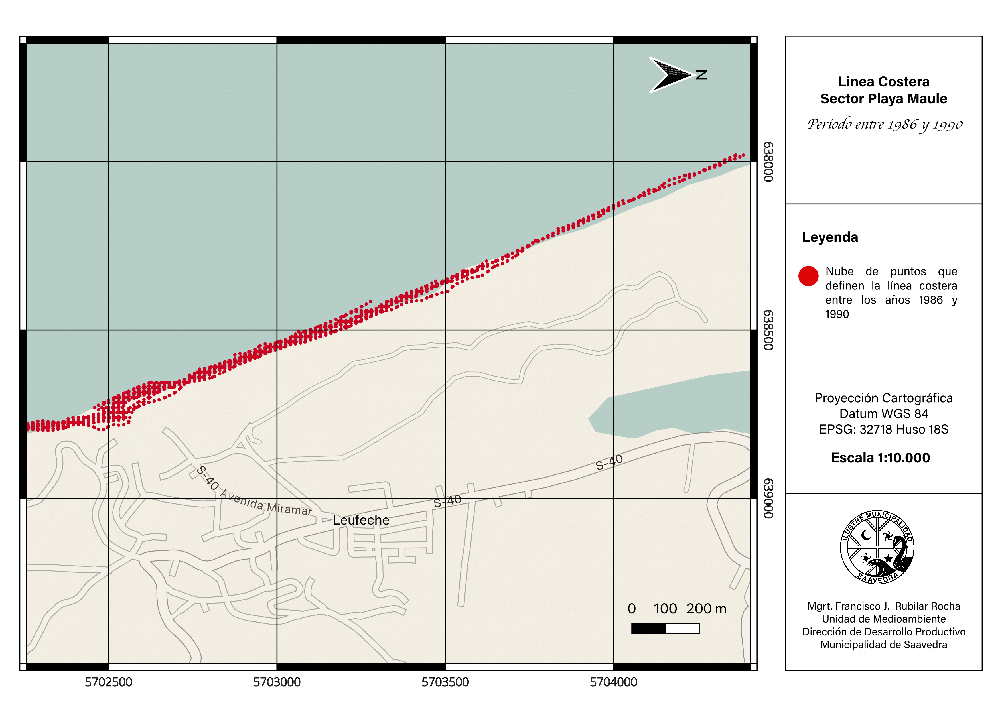
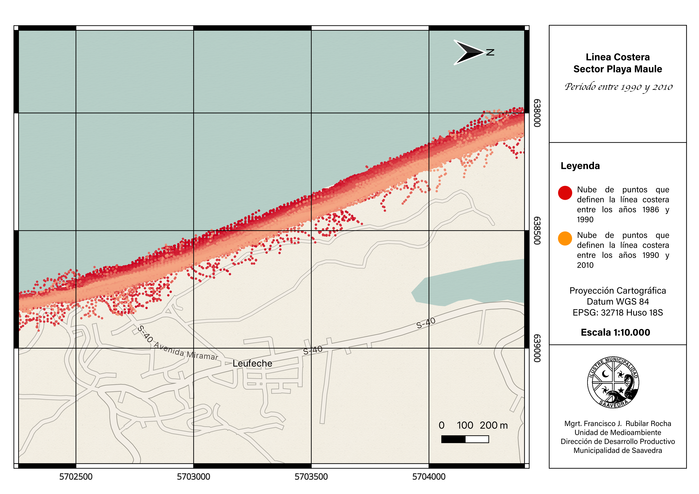

## Contexo

Puerto Saavedra goza de una hermosa playa de 2,2 km llamada **Playa
Maule**. Me gusta visitarla a menudo desde que vivo en esta ciudad. Es
un espacio que te permite apreciar la inmensidad del mar, empaparte de
su fuerza y calmar las angustias y tribulaciones en su entorno amable y
poderoso.

|  |  |
|:----------------------------------:|:----------------------------------:|
| {width="901"} |  |
| *Playa Maule a media tarde, a 200 metros de Cerro Maule el estacionamiento público.* | *Playa Maule al atardecer, a pocos metros de la barra Sur.* |

Y su belleza no radica solo en el cliché del atardecer en el mar, que se
cumple a cabalidad y de forma esplendorosa, si no que también la magia
inunda con misterio los días nublados.

|  |
|:----------------------------------------------------------------------:|
|  |
| *Playa Maule un día nublado, a 500 metros del Cerro Maule abrazando en su extensión a cientos de turistas* |
|  |
| *Playa Maule en una tarde nublada. La neblina difumina a pocos metros las siluetas de los turistas.* |

En Puerto Saavedra la gente sabe que la playa se está yendo. Lo dicen
mis vecinos que han vivido aquí cuarenta años y recuerdan hasta dónde
llegaba la arena - "*...antes había un camino bajo el Cerro Maule de
unos 80 metros don Francisco. Ese camino llegaba hasta Boca Budi y se
conectaba hasta el Cerro La Mesa...".* Bueno..., que la playa se esté
yendo, significa que la **línea costera está retrocediendo,** y al menos
a nivel local, ninguna institución había calculado la tasa de retroceso.
La gente lo sabía, la playa, retrocedía, lo que no había era un
indicador para la toma de decisiones.

Esa ausencia no es un detalle académico. Sin una cifra, la erosión
costera no entra en un instrumento de planificación, no justifica una
obra de protección y no compite por presupuesto con problemas que sí
están cuantificados. El diagnóstico territorial existía; el dato, no.

Ahora existe: **el sector de Playa Maule, frente al área poblada,
retrocede 4,36 metros por año**. Acumulados sobre cuatro décadas, son
unos 174 metros de playa perdidos.

## Por qué no estaba medido

En la revisión de antecedentes, encontré tres categorías de información
sobre la costa de Saavedra, y ninguna cuantifica el retroceso. Hay
estudios geomorfológicos regionales ([Peña-Cortés,
2014](https://scielo.conicyt.cl/pdf/rgeong/n58/art13.pdf)) que describen
la costa de La Araucanía sin entregar tasas de cambio. [Ledezma
(2020)](https://www.researchgate.net/publication/344242491_Interpretaciones_geologicas_de_remociones_en_masa_en_latitudes_medias_Caso_de_estudio_en_la_zona_de_Puerto_Saavedra_IX_Region)
realizó, en el marco del proyecto FONDECYT 11180500, el primer estudio
dedicado a interpretar geológicamente los procesos de remoción en masa
en la zona de Puerto Saavedra, incluyendo el primer mapa de
susceptibilidad para el sector, aunque acotado a procesos de ladera
puntuales sin proyección hacia el retroceso de la línea de costa.

Tampoco hay informes de organismos de emergencia que cuantifiquen el
proceso: la intervención institucional se limita a alertas operativas
por marejadas.

En el propio Plan de Acción Comunal de Cambio Climático de Saavedra,
reconocemos la erosión del borde costero como riesgo comunal, pero en su
diseño no se pudo cuantificar las cadenas de impacto por falta de
información local de base. Este levantamiento es precisamente esa base.

## Cómo se mide una playa desde el espacio

Cuando "vemos" un paisaje, en realidad vemos la luz del sol que ese
paisaje refleja. Nuestros ojos son sensores que "captan" la luz que les
llega de rebote al chocar, literalmente, con todo lo que alcanza nuestra
vista. Y esa luz le da texturas y colores a las cosas con las que
interactúa. Luego, nuestro cerebro interpreta esa información de
texturas y colores y nos permite discriminar en un paisaje lo que es un
árbol, lo que es una piedra, lo que es agua y lo que es suelo. Los
satélites hacen lo mismo, pero con unos SUPER OJOS, que les permiten
"ver" el calor que emitimos todos los seres vivos e incluso el nivel de
clorofila en un predio forestal. Y con esa supervista, los satélites, a
kilómetros sobre el suelo pueden discriminar MUCHAS más cosas que
nuestros ojos, en todo el espectro electromagnético (bandas
electromagnéticas).

El agua y la arena reflejan la luz de forma muy distinta en el
infrarrojo de onda corta: el agua absorbe casi toda esa energía y
aparece oscura, mientras la arena seca, la refleja. Combinando esa banda
con la del verde se obtiene un índice que separa ambas superficies con
nitidez, **y el límite entre las dos es la línea de costa.**

Lo que hace interesante el ejercicio no es medir una vez, sino medir
muchas. El archivo satelital abierto de la NASA y el Servicio Geológico
de Estados Unidos cubre la costa chilena desde 1986 de forma continua, y
Copernicus lo complementa desde 2015 con mayor resolución. Son cuatro
décadas de fotografías del mismo lugar, tomadas cada dos semanas,
disponibles sin costo.

El levantamiento procesó **2.899 imágenes de cinco misiones
satelitales**, de las que obtuve **1.457 posiciones válidas de la línea
de costa**. Cada posición se mide con precisión subpíxel, es decir mejor
que el tamaño nominal de la celda de 30 metros, mediante interpolación
del índice espectral.

::: {.callout-note collapse="true"}
## Sobre los transectos

El cambio no se mide sobre la línea completa sino sobre 127 transectos
perpendiculares a la costa, espaciados cada 50 metros y con 600 metros
de longitud. Para cada transecto se registra la distancia a la que cruza
la línea de costa en cada fecha, y de esa serie de distancias contra
tiempo sale la tasa de cambio por regresión lineal.

Tres decisiones fueron relevantes. Se trazaron tres líneas base
independientes en vez de una continua, excluyendo deliberadamente las
dos desembocaduras, porque allí manda la dinámica estuarina y no la
erosión oceánica. La longitud de 600 metros se fijó tras comprobar que
una configuración más corta truncaba las mediciones justamente en el
sector de mayor variación histórica. Y se verificó que el vértice de
origen de cada transecto cayera en el continente, condición necesaria
para que el signo de la tasa tenga sentido.
:::

{#fig-nubes}

## El litoral no se comporta igual en todas partes

Este es el resultado que no esperaba, y probablemente el más útil.

| Sector               | Transectos |      Tasa media |       R² | Cambio acumulado |
|:--------------|--------------:|--------------:|--------------:|--------------:|
| Norte de Cerro Maule |         53 |     −0,02 m/año |     0,00 |            ≈ 0 m |
| **Playa Maule**      |         54 | **−4,36 m/año** | **0,81** |       **−174 m** |
| Sur de Boca Budi     |         20 |     −2,14 m/año |     0,53 |            −86 m |

: Tasas de cambio de la línea costera por sector, 1986–2026

De los 127 transectos analizados, 74 presentan erosión significativa, 53
se mantienen sin tendencia neta y **ninguno registra avance de la línea
de costa**.

La diferencia entre el norte y el sur de Cerro Maule es tan marcada que
conviene mirarla en detalle. En las dos figuras siguientes cada línea es
la costa en un año distinto, con el color indicando el año y la costa
rotada a la horizontal para poder comparar.

{#fig-maule}

{#fig-norte}

En Playa Maule el orden cronológico es la firma de un desplazamiento
sostenido, y explica el R² de 0,81. Al norte, en cambio, el R² de 0,00
no significa que no pase nada: significa que lo que pasa no tiene
dirección. La costa se mueve, pero vuelve.

**Cerro Maule opera como divisoria entre dos celdas litorales
distintas.** El promontorio rocoso interrumpe el transporte de sedimento
a lo largo de la costa, y lo que ocurre a un lado no se transmite al
otro. Para la gestión esto importa mucho: cualquier obra de protección
diseñada para Playa Maule no puede suponer que el sector norte se
comporta igual, y tampoco puede ignorar que intervenir un punto de la
celda transfiere el problema al resto.

Hay un segundo patrón dentro de Playa Maule. Los ocho transectos de
mayor retroceso son consecutivos y están próximos a la desembocadura del
río Imperial, con tasas de entre 5,3 y 5,9 metros por año. Esa
concentración no es casual, y es el tema de un [segundo análisis
dedicado a la migración de la desembocadura](#) que publicaré por
separado.

## Qué dice la proyección, y qué no dice

Extrapolando la tendencia medida hacia adelante, Playa Maule perdería
otros 43,6 metros de playa en diez años y 87,1 en veinte. En el
escenario desfavorable, que considera el límite superior del rango de
retroceso, esas cifras suben a 62 y 123,9 metros.

{#fig-proy}

Conviene ser claro sobre qué es esto. **Es una extrapolación de la
tendencia medida, no un pronóstico.** No incorpora una posible
aceleración por ascenso del nivel del mar, no considera cambios en el
aporte de sedimento de las desembocaduras vecinas, y no captura el
efecto de eventos extremos puntuales que pueden producir retrocesos muy
superiores a la tendencia media en pocos días.

Dicho eso, la proyección de Playa Maule es la más confiable de las tres
justamente porque su tendencia histórica es la más consistente: un R²
alto determina una pendiente bien acotada y, por tanto, un intervalo de
proyección estrecho.

## Lo que esto cambia institucionalmente

El PACCC comunal contempla en su Medida N°17 la ejecución de obras de
drenaje y defensas costeras, con inicio programado para el período
2031–2035. Aplicando la tasa medida, el cálculo es incómodo: **el
retroceso acumulado alcanzaría unos 22 metros antes de que la medida
comience y 39 metros antes de que termine**. Es superficie de playa que
se pierde de forma irrecuperable durante el período de espera.

Ese cálculo es el argumento técnico para evaluar la reclasificación
temporal de la medida desde mediano a corto plazo en el sector de Playa
Maule. No es una opinión sobre prioridades presupuestarias: es lo que se
deduce de multiplicar una tasa por un plazo.

Hay además dos consideraciones que cualquier diseño de obra debe
incorporar. La primera es la transferencia de erosión hacia sectores
adyacentes, que ya mencioné. La segunda es que existe una solicitud de
Espacio Costero Marino de Pueblos Originarios en tramitación sobre el
sector, de 2.138 hectáreas, lo que tiene implicancias sobre los
procedimientos de consulta aplicables.

## Limitaciones

Los resultados son preliminares en un punto específico: **falta aplicar
la corrección por nivel de marea**. Una línea de costa detectada con
marea alta aparece más retraída que la misma costa con marea baja, y esa
diferencia se suma como ruido a la serie. La corrección está en
ejecución y se espera que modifique las magnitudes sin alterar la
dirección ni el orden de magnitud de las tendencias.

Hay además un vacío de cobertura satelital entre 1988 y 1997, por
limitaciones históricas de recepción de datos en Sudamérica. Se verificó
recalculando las tasas sin el período previo al vacío: la variación es
de 0,06 metros por año en el sector crítico, de modo que la tendencia es
robusta a ese hueco.

## Reproducibilidad

Todo el levantamiento se ejecutó con datos de acceso abierto y
herramientas gratuitas. Eso tiene una consecuencia práctica que va más
allá de este resultado: **el municipio puede actualizar la serie cada
año sin depender de consultoría externa**, con resolución espacial de 50
metros a lo largo de todo el litoral comunal.

Pasar de no tener ninguna cifra a tener una línea base replicable y
actualizable es, probablemente, el resultado más duradero de este
trabajo. El número puede discutirse y va a refinarse; el instrumento
queda.

------------------------------------------------------------------------

::: callout-tip
## Datos y documentación

El reporte ejecutivo completo, con metodología detallada, control de
calidad y apéndice cartográfico, está disponible en la Unidad de Medio
Ambiente de la Ilustre Municipalidad de Saavedra. Los códigos de
procesamiento y las capas geoespaciales se comparten a solicitud para
verificación y replicación.
:::

## Referencias

Gorelick, N., Hancher, M., Dixon, M., Ilyushchenko, S., Thau, D. y
Moore, R. (2017). Google Earth Engine: Planetary-scale geospatial
analysis for everyone. *Remote Sensing of Environment*, 202, 18–27.
<https://doi.org/10.1016/j.rse.2017.06.031>

Himmelstoss, E. A., Henderson, R. E., Kratzmann, M. G. y Farris, A. S.
(2018). *Digital Shoreline Analysis System (DSAS) version 5.0 user
guide*. U.S. Geological Survey Open-File Report 2018-1179.
<https://doi.org/10.3133/ofr20181179>

Martínez, C., Winckler, P., Agredano, R., Esparza, C., Torres, I. y
Contreras-López, M. (2022). Coastal erosion in sandy beaches along a
tectonically active coast: The Chile study case. *Progress in Physical
Geography: Earth and Environment*, 46(2), 250–271.
<https://doi.org/10.1177/03091333211057194>

Vos, K., Splinter, K. D., Harley, M. D., Simmons, J. A. y Turner, I. L.
(2019). CoastSat: A Google Earth Engine-enabled Python toolkit to
extract shorelines from publicly available satellite imagery.
*Environmental Modelling & Software*, 122, 104528.
<https://doi.org/10.1016/j.envsoft.2019.104528>
